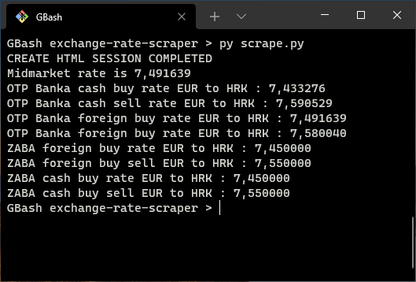

# Currency Exchange Rate Scraper for Croatian Banks

## Information

The [project](https://github.com/users/smamusa/projects/4/views/1) is to create a Java console application which would enable the user to scrape all currency exchange rates in Croatian banks.

Future plans include development of an API with a background job running once per day, scraping the data and feeding it to a RDBMS and then serving it through an API thus creating a historical reference.

If you want to be included in the project please provide your information on the [discussions page](https://github.com/smamusa/exchange-rate-scraper/discussions/categories/project-access-requests)

### Project access request:

- Name Lastname
- I would like to work on (scraping, parsing, API, deployment, UI)
- Technology I'd like to use (only for front-end)

## Screenshot

## Banks

- [x] OTP
- [x] ZABA
- [ ] Erste
- [ ] HPB
- [ ] PBZ

## To-Do

- [ ] Save rates in a txt or csv file
- [ ] Update README.md with Java instructions
- [x] Add other rates
- [ ] Assign project task for wherever attention is needed
